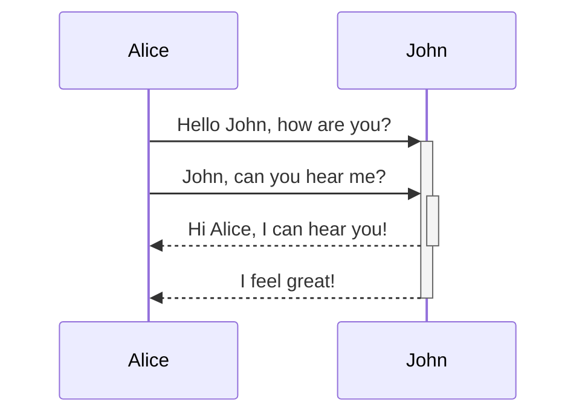

---
cssclass:
title: Obsidian使用及标准
tags: [Resource/Ob]
image-auto-upload: true
date: 2022-09-23 20:55:45
lastmod: 2022-10-25 00:55:40
---
# Obsidian使用及标准
## 标准

- 目录前缀 0x 只是为了方便排序。
- 目录外层结构遵循 IARP，但具体使用按实际个人情况来定。
- 尽可能少的使用插件，尽可能少的使用特殊的 markdown 语法。保持简单、整洁。
- 文章加入元信息，即 Front Matter，要表明文章的标签，方便归类及查找。
- 文件或标签等命名规则，大驼峰命名，使用 _ 隔开
- 目录层级最多不要超过三层，使用标签 + 双向链接代替多层级目录。多使用链接功能。
- 目录上添加一些概览，比如目录下的笔记，或者对一些标签的展示，可以使用 query 语法，或者 dataview 来创建。
~~- 卡片放置在 Memos 目录中~~
- 图片尽量使用图床，不重要的可以使用 b 站图床，重要的使用 github 图床，配置 picgo 插件。

---
## 使用

#### 同步问题

放弃插件同步，使用 git 同步，同步前生成 zip 包，同步后解压即可。
手机端使用 termux 作为 git 客户端 [[../0x01_Area/IT/termux安卓]]

~~暂时放弃 remote-save 使用 onedrive 的方式，因为文件或结构修改会不同步。~~
~~使用 syncing 代替。手机端仅接受，并忽略 .obsidian 目录。~~
~~回归 onedrive ，插件及配置只在一台电脑上设置，配合 shell 命令压缩配置文件，其他设备解压覆盖。~~
~~并且不自动更新，手动更新，或者更新时间拉长。
同步不要开启 proxy 插件，否则会同步失败~~

#### 预览编辑切换
快捷键 ctrl + e

#### 注释功能
Here is some inline comments: %%You can't see this text%% (Can't see it)

Here is a block comment:
%%
It can span
multiple lines
%%

#### Embed 嵌入
[[]]
如果要嵌入当前文档， 前面加 ！ 即![[]]
链接到标题：[[##]]
链接到文本块 ：[[^]]
链接指定文本：[[xx##|说明]]
全局选择文本块：[[^^]]

#### 脱字符 ^^
示例：![[^^ 文 章 内 容]] 空格为多搜索条件与 相当于 sql 中 and

#### OneDrive 同步：
只同步一个设备的配置,其他设备拷贝.obsidian 目录即可

#### 快速转 todolist
ctrl+enter

#### 纯文本粘贴
ctrl+shift+v

#### 标注
类型
- note
- abstract, summary, tldr
- info, todo
- tip, hint, important
- success, check, done
- question, help, faq
- warning, caution, attention
- failure, fail, missing
- danger, error
- bug
- example
- quote, cite

> [!INFO]
> Here's a callout block.
> It supports **markdown** and [[Internal link|wikilinks]].

折叠展开
\+ 或者 \-
> [!FAQ]- Are callouts foldable?
> Yes! In a foldable callout, the contents are hidden until it is expanded.

#### 字体样式
*This text will be italic*
_This will also be italic_
**This text will be bold**
__This will also be bold__
_You **can** combine them_

#### 图片

自定义大小


#### 任务
- [x] ##ob/示例, [links]() , **formatting** supported
- [x] list syntax required (any unordered or ordered list supported)
- [x] this is a complete item
- [x] this is also a complete item (works with every character)
- [ ] this is an incomplete item
- [ ] tasks can be clicked in Preview to be checked off

#### 表格
First Header | Second Header
------------ | ------------
Content from cell 1 | Content from cell 2
Content in the first column | Content in the second column

Tables can be justified with a colon | Another example with a long title
:----------------|-------------:
because of the `: ` | these will be justified

First Header | Second Header
------------ | ------------
[[Format your notes\|Formatting]]    |  [[Callouts\|Callouts]]

#### 数学公式
$$\begin{vmatrix}a & b\\
c & d
\end{vmatrix}=ad-bc$$

#### 画


#### 添加脚注
论文引用[^1] [^2] [^3]

#### query 查询
```query
tag: 只查找tag,其他同理
```
```query
全局查找搜索条件
```

#### chart 图表
```chart
type: bar
labels: [数值1]
series:
  - title: 柱型图1
    data: [10]
tension: 0.8
width: 80%
labelColors: true
fill: true
beginAtZero: true
```

---
[^1]: 哈哈
[^2]: 手动添加的
[^3]: 使用 \/号生成
